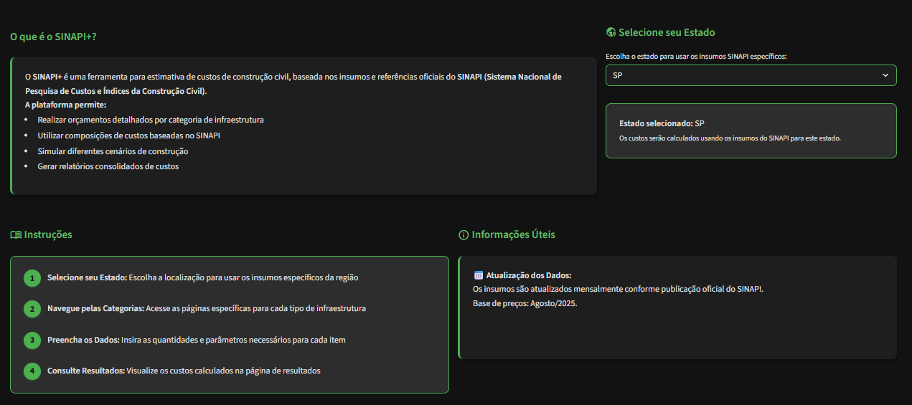
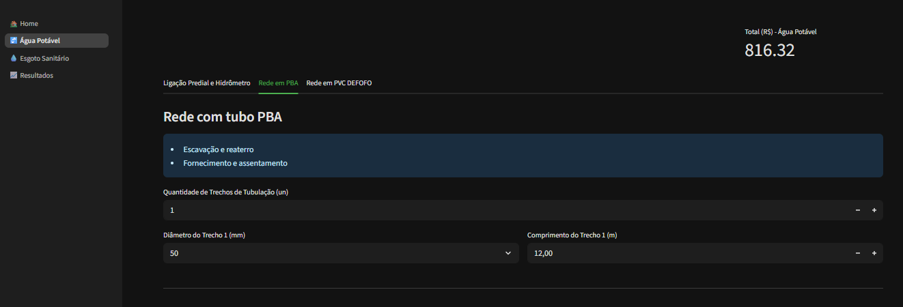
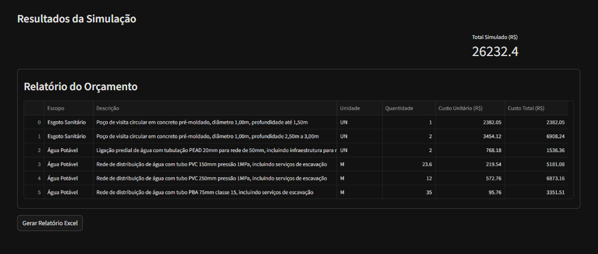

# SINAPI+ 
## Simulador de Custos de Infraestrutura
[](https://streamlit.io/) [](https://www.python.org/) [](https://pandas.pydata.org/)


## 🔍 **Sobre o Projeto**
O SINAPI+ é uma aplicação web desenvolvida em Python/Streamlit que simula custos de projetos de infraestrutura com base nas composições e insumos do SINAPI (Sistema Nacional de Pesquisa de Custos e Índices da Construção Civil) da Caixa Econômica Federal.

A aplicação permite criar orçamentos detalhados para diferentes categorias de infraestrutura, com preços regionalizados para todos os estados brasileiros.







## 🚀 **Funcionalidades Principais**

**Simulação de Custos**

- Seleção de Itens: Escolha entre composições pré-definidas de infraestrutura.

- Quantificação Flexível: Defina quantidades personalizadas para cada item.

- Especificação Detalhada: Ajuste parâmetros técnicos conforme necessidade.

**Regionalização de Preços**

- Abrangência Nacional: Preços específicos para todos os 27 estados brasileiros.

- Atualização Automática: Baseado nos dados oficiais mais recentes do SINAPI.

- Comparação Regional: Analise variações de custo entre diferentes estados.

**Categorias Implementadas**

- Água Potável: Ligações prediais, redes de distribuição, hidrômetros.

- Esgoto Sanitário: Redes coletoras, poços de visita, ligações prediais.

Em expansão: Pavimentação, Drenagem, Energia

## 🛠️ Tecnologias Utilizadas

| Tecnologia | Versão | Finalidade | Badge |
|------------|--------|------------|-------|
| **Python** | 3.9+ | Linguagem principal |  |
| **Streamlit** | 1.28+ | Framework web e interface |  |
| **Pandas** | 2.0+ | Manipulação e análise de dados |  |
| **OpenPyXL** | 3.1+ | Leitura de planilhas Excel |  |

## 📁 Estrutura do Projeto

```bash
sinapi+/
├── 📂 app/
│   ├── main.py                       # Inicialização multipage do Streamlit
│   ├── app_state.py                  # Persistência de estado (session_state)
│   ├── data_loading.py               # Cache e carregamento das bases (.xlsx)
│   ├── utils.py                      # Funções auxiliares gerais
│   │
│   ├── 📂 pages/
│   │   ├── home.py                   # Página inicial
│   │   ├── sinapi_agua_potavel.py    # Interface para inputs de Água
│   │   ├── sinapi_esgoto.py          # Interface para inputs de Esgoto
│   │   └── resultados.py             # Exibição do orçamento, totais e avisos
│   │
│   ├── 📂 configs/
│   │   ├── config_agua.py            # CONFIG_AGUA
│   │   └── config_esgoto.py          # CONFIG_ESGOTO
│   │
│   ├── 📂 excel_files/
│   │   ├── base_composicoes.xlsx
│   │   └── precos_composicoes_insumos.xlsx
│   │
│   └── 📂 images/
├── ProcessarComposicao.py               # TODAS AS CLASSES DO MOTOR DE CÁLCULO
│                                        # (InputCollector, InputMapper,
│                                        #  OrcamentoBuilder, Precificador,
│                                        #  OrcamentoAnalyzer)
│
├── requirements.txt
└── README.md
```


## Como Utilizar
**1. Seleção de Categoria**
- Selecione o Estado desejado na página Home.
- Navegue entre as páginas: Água Potável ou Esgoto Sanitário.
- Cada categoria possui composições específicas disponíveis separadas por abas de acordo com o item a ser orçado.

**2. Simulação e Resultados**
- Custo Unitário: Preço por unidade para o estado selecionado.

- Custo Total: Valor total baseado na quantidade especificada.

- Detalhamento: Breakdown por componentes e insumos.

3. Análise Comparativa
Compare custos entre diferentes estados e exporte resultados para análise.


## 🔧 Instalação e Execução
**Pré-requisitos**
- Python 3.9 ou superior
- Git

**Passo a Passo:**

**1. Clone o repositório**
```python
git clone https://github.com/viviangiulia/sinapi_plus.git
```

**2. Acesse o diretório**
```python
cd sinapi+
```

**3. Crie um ambiente virtual**
```python
python -m venv venv
```

**4. Ative o ambiente virtual**
 - Windows:
    ```python
    venv\Scripts\activate
    ```
 - Linux/Mac:
    ```python
    source venv/bin/activate
    ```
**5. Instale as dependências**
```python
pip install -r requirements.txt
```
**6. Execute a aplicação**
```python
streamlit run app/main.py
```

## 📈 Fontes de Dados
[SINAPI/Caixa Econômica Federal:](https://www.caixa.gov.br/) Dados oficiais de composições e insumos.

    - Atualização Mensal: Valores revisados mensalmente conforme calendário oficial

    - Abrangência Nacional: Cobertura completa de todos os estados brasileiros

## 🤝 Contribuição
Contribuições são bem-vindas! 

Áreas de melhoria:

- Implementar novas categorias (pavimentação, drenagem)

- Desenvolver análises preditivas

- Criar dashboard comparativo histórico

## 📄 Licença
Este projeto é destinado para fins educacionais e de portfólio. Os dados do SINAPI são de domínio público, disponibilizados pela Caixa Econômica Federal.

## 👩‍💻 Autora
**Vivian Giulia Fernandes**

Engenheira Civil formada pela Universidade Federal de Minas Gerais descobrindo como solucionar problemas e otimizar processos através da programação.

[](https://www.linkedin.com/in/vivian-fernandes-099b34149/) [](https://github.com/viviangiulia)


**⚠️ Disclaimer:**
 Este projeto não possui vínculo oficial com a Caixa Econômica Federal. Os dados do SINAPI são utilizados conforme disponibilização pública para fins educacionais e de demonstração técnica.